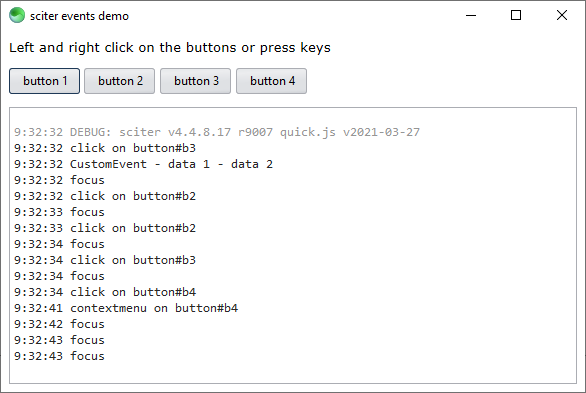

# sciter events

This [sciter.js](https://sciter.com/) project demonstrates the various ways to deal with events.



## demo

- git clone the repository
- install packages `npm install`
- install latest sciter sdk `npm run install-sdk`
- start the demo `npm run scapp`

## demo requirements

- A recent version of Node.js `node` (tested with 22 LTS) and its package manager `npm`.
    - On Windows [download](https://nodejs.dev/download/) and run the installer
    - On Linux check the [installation guide](https://www.digitalocean.com/community/tutorials/how-to-install-node-js-on-ubuntu-20-04#option-2-%E2%80%94-installing-node-js-with-apt-using-a-nodesource-ppa)

## event

An event is a signal that something has happened. All DOM nodes generate such signals but events are not limited to the DOM.

[https://javascript.info/introduction-browser-events](https://javascript.info/introduction-browser-events)

## known events list

[https://github.com/c-smile/sciter-js-sdk/blob/main/docs/md/Event.md#known-events](https://github.com/c-smile/sciter-js-sdk/blob/main/docs/md/Event.md#known-events)

## event handlers

Event handlers allow to react to events and there are 3 different types:

### 1. direct element event handler

Element event handlers are attached to a particular element explicitly, which means that the **DOM element must exist for the event handler to attach to it**.

- `element.on(eventName, function(event) {…})` jQuery like form of event subscription. It matches `addEventListener()` functionality but is less verbose.  And it also allows to subscribe to events in capturing phase by prepending ^ to eventName.
- `element.addEventListener(eventName, handler [,options])` standard HTML5 event handler
- `element.oneventname = function(event) {…}` primitive way and not recommended because of its limitations such just one click handler can be attached to any element. to confirm: propagation cannot be stopped?

### 2. group (a.k.a. filtered) event handler

`element.on(eventName, "css selector", function(event, matchedElement) {…})`
- applies to all elements matching css selector
- Elements added to the DOM after the event handler was added are also tracked

### 3. class component event handler

This group of event handlers is strictly Sciter specific and is used in class based UI components.

`["on eventname at css-selector"](event, matchedChild) {}`

For more info, check the sciter doc [https://sciter.com/event-handling-in-sciter/](https://sciter.com/event-handling-in-sciter/)

## listen to multiple events

Event names can be combined.

`document.on("click mousedown mouseup", function(event) {…})`

## event object

[https://github.com/c-smile/sciter-js-sdk/blob/main/docs/md/Event.md](https://github.com/c-smile/sciter-js-sdk/blob/main/docs/md/Event.md)

## event propagation

The event propagation is bidirectional, from the window to the event target and back. This propagation can be divided into three phases:

1. capture phase : from the window to the event target parent `^`
2. target phase : the event target itself
3. bubble phase : from the event target parent back to the window

[https://towardsdev.com/event-propagation-in-javascript-4478852695cf](https://towardsdev.com/event-propagation-in-javascript-4478852695cf)
[https://javascript.info/bubbling-and-capturing](https://javascript.info/bubbling-and-capturing)

### event capturing

The event moves from the outermost element to the target element. It is rarely used in real code.

### event bubbling

When an event happens on an element, it first runs the handlers on it, then on its parent, then all the way up on other ancestors.

But any handler may decide that the event has been fully processed and stop the bubbling by calling `event.stopPropagation()`. An alternative way to stop the propagation is to return `true` inside the event handler. Don’t stop bubbling without a need!

If an element has multiple event handlers on a single event, then even if one of them stops the bubbling, the other ones still execute. In this case use `event.stopImmediatePropagation()`.

```js
document.on("click", "button", function(event) {
    console.log("clicked 1");
});

document.on("click", "button", function(event) {
    console.log("clicked 2");

    // stops propagation
    return true;
});

document.on("click", "button", function(event) {
    console.log("clicked 3");

    // return false and no return have no effect on propagation
    return false;
});
```

```txt
LOG: clicked 3
LOG: clicked 2
```

## send events from code

Events can also be sent from the javascript code by using the `dispatchEvent (sync)` and `postEvent (async)` method.

`element.dispatchEvent(new Event(typeArg [, eventInit]));`

`eventInit`
- `bubbles` default `false`
- `cancelable` default `false`
- `composed` default `false` whether the event will trigger listeners outside of a shadow root

```js
document.addEventListener("click", function(event) {
    console.log(event.type);
}, false);

const event = new Event("click", {
    "bubbles": true,
    "cancelable": false,
    "composed": false,
});

document.dispatchEvent(event);
```

[https://developer.mozilla.org/en-US/docs/Web/API/Event/Event](https://developer.mozilla.org/en-US/docs/Web/API/Event/Event)

### custom events

```js
document.addEventListener("myevent", function(event) {
    console.log(event.detail.data1);
    console.log(event.detail.data2);
}, false);

const event = new CustomEvent("myevent", {
    detail: {
        data1: "data 1",
        data2: "data 2"
    }
});

document.dispatchEvent(event);
```

[https://developer.mozilla.org/en-US/docs/Web/Events/Creating_and_triggering_events#creating_custom_events](https://developer.mozilla.org/en-US/docs/Web/Events/Creating_and_triggering_events#creating_custom_events)
